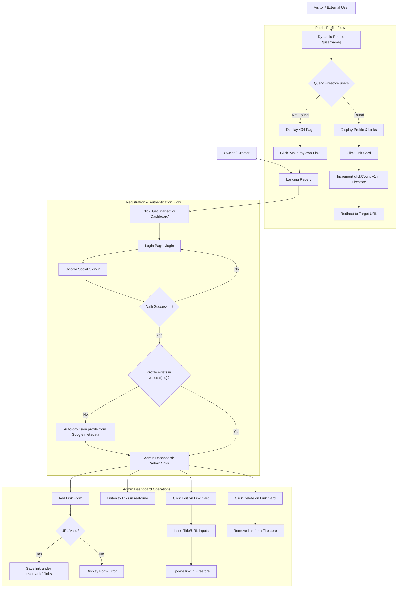

# My Link: Wireframes

This document details the layout structure, screen grids, and responsive visual architecture of the My Link platform using textual layout descriptions and structural ASCII diagrams.

## Document Version Control

| Version | Date | Author | Description |
| :--- | :--- | :--- | :--- |
| v1.0.0 | 2026-05-24 | AI Assistant | Initial draft capturing landing page, login, dashboard layout, and public page wireframes. |
| v1.1.0 | 2026-05-24 | AI Assistant | Added Mermaid-based screen navigation and application flowchart. |

---

## 1. Landing Page Wireframe (`/`)

A high-performance landing page designed to attract creators. It uses a centered header, a wide grid body (left text, right mockup), and a bottom footer.

### 1.1 Structural Layout Diagram

```text
+-----------------------------------------------------------------------------------+
|  [Logo] My Link                                               [Go to Dashboard]   |  <- Header
+-----------------------------------------------------------------------------------+
|                                                                                   |
|    [Sparkles Badge: Create in 1 Minute]                                           |
|                                                                                   |
|    ONE SINGLE LINK             +---------------------------------------+          |
|    THAT EXPRESSES YOU          |              (Mobile Notch)           |          |  <- Hero
|                                |              [Avatar Circle]          |          |     Section
|    Aggregate all your SNS      |               @mylink_user            |          |
|    and analyze clicks in       |               "Welcome!"              |          |
|    real time.                  |                                       |          |
|                                |         +--------------------+        |          |
|    [Get Started for Free >]    |         | YouTube Channel    |        |          |
|                                |         +--------------------+        |          |
|    [v] Google Social Login     |         | Instagram Link     |        |          |
|    [v] Real-time Analytics     |         +--------------------+        |          |
|                                +---------------------------------------+          |
|                                               Mobile Preview Frame                |
+-----------------------------------------------------------------------------------+
|  (C) 2026 My Link. All rights reserved.                                           |  <- Footer
+-----------------------------------------------------------------------------------+
```

### 1.2 Layout Grid & Key Elements
- **Header**: Flex container, `justify-between`. Left contains the brand logo and text; right displays the action link button navigating to `/login`.
- **Hero Grid**: Responsive 2-column grid (`grid-cols-1 lg:grid-cols-2`). 
  - **Left Column**: Text stack containing badge, main headings (`h1` with line-break), subtext description, action call button (`Get Started`), and a verified features list.
  - **Right Column**: Center-aligned mockup frame simulating a glassmorphic smartphone viewport width (`max-w-[300px]`) containing placeholder avatar, username handle, bio text, and mock link buttons.

---

## 2. Login Page Wireframe (`/login`)

A centered card wrapper containing authentication inputs, warnings, and error indicators, optimized for mobile viewports.

### 2.1 Structural Layout Diagram

```text
+-------------------------------------------------------------+
|                                                             |
|                   +-------------------------+               |
|                   |        [Lock Icon]      |               |
|                   |         My Link         |               |
|                   |  "Aggregate & Share"    |               |
|                   +-------------------------+               |
|                   | [!] Firebase Config Req |               |  <- Optional Config Alert
|                   +-------------------------+               |
|                   | [!] Social Login Error  |               |  <- Optional Error Alert
|                   +-------------------------+               |
|                   | [G G logo] Login button |               |
|                   +-------------------------+               |
|                                                             |
+-------------------------------------------------------------+
```

### 2.2 Layout Grid & Key Elements
- **Layout**: Full-screen flex container, `items-center justify-center`. Uses floating blurry background decorative indicators.
- **Login Box**: Absolute constrained width container (`max-w-md w-full`).
  - **Header Block**: Vertical stack showing lock icon, application text name, and bio caption.
  - **System Alerts**: Rendered conditionally directly above login controls. Yellow themed for config alerts and red themed for authentication errors.
  - **Button Control**: Wide block button displaying official Google colored logo, button text, and hover sliding arrow.

---

## 3. Admin Dashboard Wireframe (`/admin/links`)

A dual-pane layout providing management controls on the left/top and links lists on the right/bottom.

### 3.1 Structural Layout Diagram

```text
+-----------------------------------------------------------------------------------+
|  [Logo] My Link / Dashboard                                       [Logout Button] |
+-----------------------------------------------------------------------------------+
|                                                                                   |
|  Links Management  [Real-Time Storage Live Badge]                                 |  <- Main Title
|  ------------------------------------------------                                 |
|                                                                                   |
|  [Left Column: Controls]                     [Right Column: Links List]           |
|  +---------------------------------------+   +---------------------------------+  |
|  | MY PROFILE PREVIEW                    |   | Link List                       |  |
|  | +-----------------------------------+ |   | +-----------------------------+ |  |
|  | | [Avatar] displayName (@username)   | |   | | [=] YouTube channel         | |  |
|  | | "bioText details"                 | |   | |     url / clickCount: 15    | |  |
|  | +-----------------------------------+ |   | |     [Open] [Edit] [Delete]  | |  |
|  | | Live URL: origin/username         | |   | +-----------------------------+ |  |
|  | | [Copy Link] [Visit Page]          | |   |                                 |  |
|  | +-----------------------------------+ |   | +-----------------------------+ |  |
|  |                                       |   | | [=] Instagram Feed          | |  |
|  | ADD NEW LINK                          |   | |     url / clickCount: 8     | |  |
|  | +-----------------------------------+ |   | |     [Open] [Edit] [Delete]  | |  |
|  | | Title: [________________________] | |   | +-----------------------------+ |  |
|  | | URL:   [________________________] | |   |                                 |  |
|  | |                                   | |   |                                 |  |
|  | | [ + Add Link ]                    | |   |                                 |  |
|  | +-----------------------------------+ |   |                                 |  |
|  +---------------------------------------+   +---------------------------------+  |
+-----------------------------------------------------------------------------------+
```

### 3.2 Layout Grid & Key Elements
- **Layout**: Grid system with responsive structural split (`grid-cols-1 lg:grid-cols-12`).
  - **Left Pane (`col-span-5`)**: Contains Profile Preview card and the Add Link form.
  - **Right Pane (`col-span-7`)**: Contains scrollable listing card containing individual link cards.
- **Responsive Shift**: In mobile views, the left column shifts to the top of the viewport, presenting profile previews and additions first, followed by the scrollable link cards below.

### 3.3 Link Card Inline Editing View

When editing a link card, the static display transforms inline to input forms:

```text
+-----------------------------------------------------------------------+
|  [Link Editing Mode Badge]                                      [X]   |
|                                                                       |
|  Title Input: [ YouTube Official Channel 📺________________________ ] |
|  URL Input:   [ https://youtube.com/c/creator______________________ ] |
|                                                                       |
|  [Error Alert Banner: Validation problems - Optional]                |
|                                                                       |
|                                                    [Cancel] [ Save ]  |
+-----------------------------------------------------------------------+
```

---

## 4. Public Profile Wireframe (`/[username]`)

A centered, vertical mobile viewport view showing user identity cards and stacked links.

### 4.1 Structural Layout Diagram

```text
+-------------------------------------------------------------+
|                                                             |
|                       [ Avatar Image ]                      |  <- Neon Glowing Border
|                         displayName                         |
|                         [@username]                         |  <- Pill Badge
|                                                             |
|                  "biography text goes here"                 |  <- Biography Block
|                                                             |
|                 +---------------------------+               |
|                 |  [Link] YouTube Channel   |               |  <- Link Card entry
|                 +---------------------------+               |
|                                                             |
|                 +---------------------------+               |
|                 |  [Link] Instagram Feed    |               |  <- Link Card entry
|                 +---------------------------+               |
|                                                             |
|                 +---------------------------+               |
|                 |  [Link] Official Store    |               |  <- Link Card entry
|                 +---------------------------+               |
|                                                             |
|                     [ (My Link Logo) ]                      |  <- Footer branding
|                                                             |
+-------------------------------------------------------------+
```

### 4.2 Layout Grid & Key Elements
- **Viewport Constraints**: Uses centering flex layout with width constraints restricted to mobile size (`max-w-md w-full mx-auto`) even on wide screen resolutions.
- **Identity Header**: Vertical layout. The top features a round avatar surrounded by a glowing neon border. Below, the system displays the display name, custom username badge, and centered biography block.
- **Links Container**: Stacks dynamic responsive links (`w-full`). Each card handles tap events instantly by incrementing the click counter before navigating away.

---

## 5. Screen Navigation & Application Flow

The following Mermaid flowchart represents the visual navigation hierarchy, authentication verification steps, automatic user provisioning, and visitor-triggered click counting paths.


